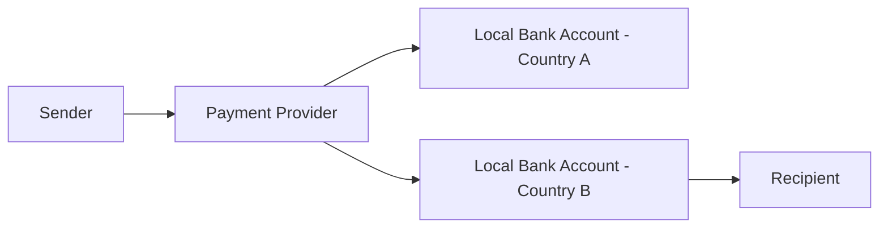

# Cross-Border Payments: Challenges and Solutions

Cross-border payments remain one of the most complex areas in financial services, but innovative solutions are emerging to address long-standing challenges.

## Traditional Challenges

The correspondent banking system has served international payments for decades, but it comes with significant limitations:

### High Costs
Traditional international transfers often involve multiple intermediary banks:

- **Correspondent bank fees** at each step
- **Foreign exchange margins** added by each institution
- **Receiving bank charges** for processing
- **Hidden fees** not disclosed upfront

### Slow Processing Times
The multi-step process creates delays:

1. **Originating bank** processes the request
2. **Correspondent banks** handle routing
3. **Receiving bank** credits the account
4. **Compliance checks** at each stage

### Limited Transparency
Customers often lack visibility into:

- **Real-time status** of their transfer
- **Actual exchange rates** being applied
- **Total fees** being charged
- **Expected delivery time**

## Modern Solutions

Fintech companies are revolutionizing cross-border payments:

### Direct Banking Relationships

Instead of correspondent banking chains, modern providers use:



This approach eliminates intermediary fees and reduces processing time.

### Real-Time Payment Rails

Leveraging domestic fast payment systems:

- **FedNow** in the United States
- **Faster Payments** in the UK
- **UPI** in India
- **PIX** in Brazil

### Blockchain-Based Solutions

Distributed ledger technology offers new possibilities:

#### Advantages:
- **24/7 processing** without banking hours restrictions
- **Transparent tracking** of transaction status
- **Reduced settlement** times
- **Lower infrastructure** costs

#### Current Limitations:
- **Regulatory uncertainty** in many jurisdictions
- **Scalability challenges** for high-volume processing
- **Energy consumption** concerns with some protocols
- **Limited adoption** by traditional financial institutions

## Regulatory Landscape

Cross-border payments must navigate complex regulatory requirements:

### Anti-Money Laundering (AML)
- **Customer identification** requirements
- **Transaction monitoring** for suspicious activity
- **Sanctions screening** against global lists
- **Record keeping** for audit purposes

### Data Protection
- **GDPR compliance** for European transactions
- **Data localization** requirements in some countries
- **Privacy regulations** affecting customer information
- **Cross-border data** transfer restrictions

## Technology Innovations

Several technologies are improving cross-border payments:

### API-First Architecture

Modern payment platforms use APIs for:

```javascript
// Example: Initiating a cross-border payment
const payment = await paymentAPI.create({
  amount: 1000,
  currency: 'USD',
  recipient: {
    name: 'John Doe',
    account: 'GB29NWBK60161331926819',
    country: 'GB'
  },
  purpose: 'Invoice payment'
});

console.log(`Payment ID: ${payment.id}`);
console.log(`Estimated delivery: ${payment.estimatedDelivery}`);
```

### Machine Learning for Compliance

AI helps with:

- **Risk scoring** of transactions
- **Automated sanctions** screening
- **Fraud detection** patterns
- **Regulatory reporting** automation

### Multi-Currency Infrastructure

Advanced platforms offer:

- **Pre-funded accounts** in multiple countries
- **Real-time currency** conversion
- **Hedging capabilities** for businesses
- **Transparent pricing** models

## Industry Trends

Several trends are shaping the future of cross-border payments:

### Central Bank Digital Currencies (CBDCs)

Many countries are exploring digital versions of their currencies:

> "CBDCs could fundamentally change how cross-border payments work, potentially enabling direct government-to-government settlement without intermediaries."

### Stablecoins for Payments

Cryptocurrency-based solutions using stable value tokens:

- **Reduced volatility** compared to traditional cryptocurrencies
- **Faster settlement** than traditional banking
- **Lower costs** for certain corridors
- **24/7 availability** for urgent transfers

### Open Banking Integration

Leveraging open banking APIs for:

- **Account verification** before sending
- **Real-time balance** checks
- **Automated reconciliation** for businesses
- **Enhanced user experience** with bank integration

## Best Practices for Businesses

Companies dealing with cross-border payments should:

1. **Compare providers** based on total cost, not just fees
2. **Understand compliance** requirements in target markets
3. **Implement proper controls** for fraud prevention
4. **Monitor exchange rates** and consider hedging strategies
5. **Maintain detailed records** for audit and tax purposes

## Future Outlook

The cross-border payments landscape will continue evolving:

- **Increased competition** driving down costs
- **Better regulatory coordination** between countries
- **More real-time payment** connections globally
- **Enhanced transparency** and customer experience

## Conclusion

While cross-border payments have historically been slow and expensive, innovative solutions are addressing these challenges. Businesses and individuals now have access to faster, cheaper, and more transparent international money transfer options.

---

*Looking to optimize your cross-border payment strategy? Our experts can help you navigate the options and find the best solution for your needs.*